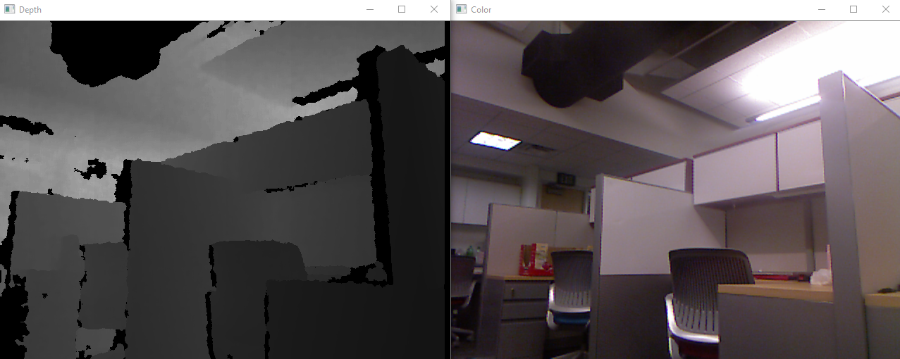

# RGBDCapture

This code is to capture RGB-D data into PNG images with an OpenNI-drived depth camera (Kinect v1, Asus XTion, etc). The RGB images are 640x480 8-bit images, and the depth images are 640×480 16-bit monochrome images. The RGB-D data is exactly in the format of [TUM RGB-D data](http://vision.in.tum.de/data/datasets/rgbd-dataset/file_formats). You can use their tools to analyze the data.

This code is written in C++ and is tested successfully in Visual Studio 2013 in Windows and Ubuntu 14.04.

An example of scanned images using Kinect v1: 



## Dependencies
- OpenCV 2.4.X -- images processing
- OpenNI2 -- driver
- Boost (>= 1.50) -- file systems

## Build
To compile the code:
* In Windows, use Visual Studio to open .sln file and compile.
* In Linux, use the standard approach
```
  $ mkdir build
  $ cd build
  $ cmake ..
  $ make
```
Note to modify corresponding paths of dependencies.

## Usage
```
./RGBDCapture
```
No input options.

## Note
* Press ESC to quit scanning.
* The RGB-D data will be saved in a newly created folder named `saveX`, where `X` is an index integer starting from 0.
* Check the path of OPENNI2 driver files if the code cannot start.
* You can use another code of mine [RGBDConverter](https://github.com/chaowang15/RGBDConverter) to convert RGB-D images into a single compressed file in KLG format, which can be taken as input of [ElasticFusion](https://github.com/mp3guy/ElasticFusion) code.
* This code doesn't give camera intrinsic parameters.
